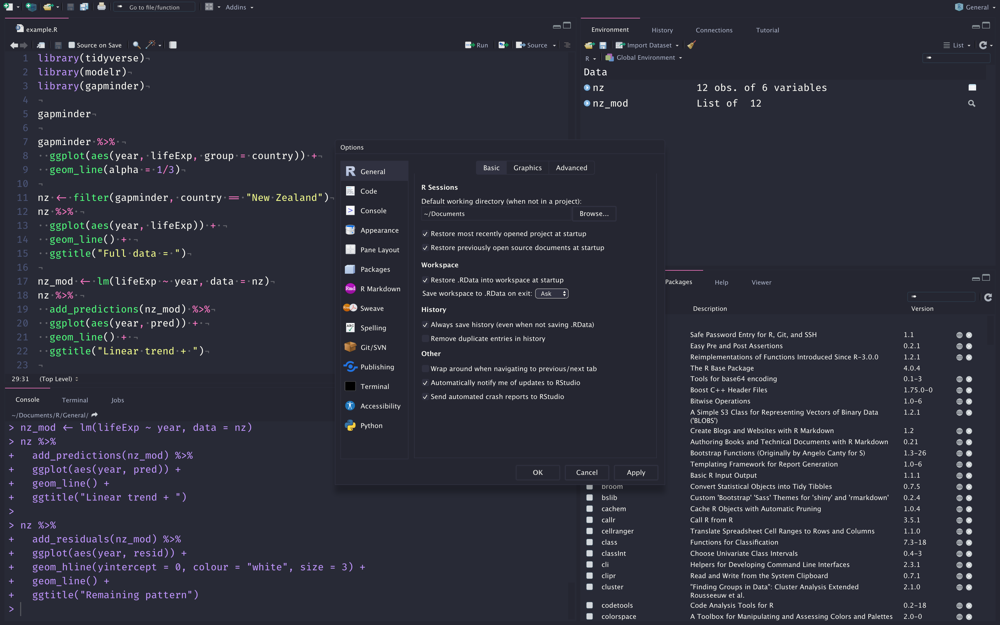

# Dracula for [RStudio](https://www.rstudio.com/)

> A dark theme for [RStudio](https://www.rstudio.com/).

## Install

All instructions can be found at [draculatheme.com/rstudio](https://draculatheme.com/rstudio).

## Team

This theme is maintained by the following person and a bunch of [awesome contributors](https://github.com/dracula/rstudio/graphs/contributors).

|  |
| ------------------------------------------------------------------------------------------- |
| [Zac de Lusignan](https://github.com/lusignan)                                              |

## Community

- [Twitter](https://twitter.com/draculatheme) - Best for getting updates about themes and new stuff.
- [GitHub](https://github.com/dracula/dracula-theme/discussions) - Best for asking questions and discussing issues.
- [Discord](https://draculatheme.com/discord-invite) - Best for hanging out with the community.

## Acknowledgements

RStudio port was largely built using [Garrick Aden-Buie](https://github.com/gadenbuie)'s [rsthemes package](https://github.com/gadenbuie/rsthemes)

## License

[MIT License](./LICENSE)
